# install-lemp-stack
L'objectif de ce mini-projet est d'installer une pile LEMP (Linux, Nginx, MariaDB, PHP). Cette configuration permet de déployer des pages web dynamiques ainsi que des applications web développées en PHP.

Les étapes ci-dessous décrivent de manière détaillée l'installation d'une pile LEMP sur un serveur Ubuntu.

Il est possible d'installer l'ensemble de la pile LEMP en exécutant le script "install-all-in-one.sh" et en fournissant les paramètres appropriés dans le fichier "app.properties". 

Si vous privilégiez l'installation séparée de chaque composant de la pile, il convient d'exécuter les scripts correspondants selon l'ordre indiqué ci-dessous.

1. ### Création d'un nom de domaine

Il est nécessaire de créer un compte sur la plateforme ClouDNS afin de bénéficier d'un service d'hébergement DNS. Cela peut être réalisé en commençant par la création d'une zone DNS gratuite, suivie de l'ajout d'un enregistrement de type A, comme illustré dans les figures 1 et 2.


<p align="center">
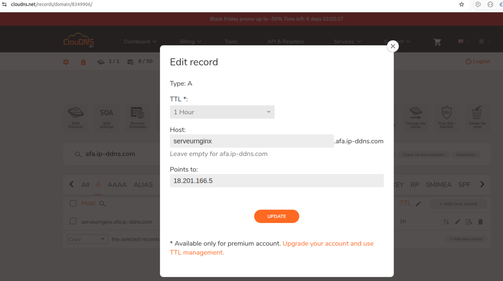
</p>
<p align="center" style="font-weight: bold;">
Figure 1: création d’un enregistrement de type A
</p>

La figure 2 illustre l'enregistrement ClouDNS créé, intitulé **serveurnginx.afa.ip-ddns.com**, lequel pointe vers l'adresse IP publique de notre machine virtuelle.

<p align="center">
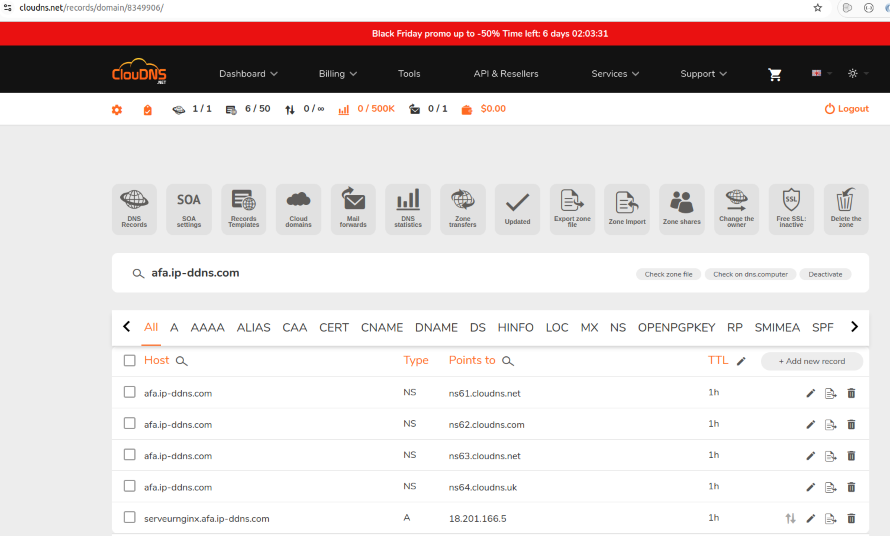
</p>
<p align="center" style="font-weight: bold;">
Figure 2: illustration des alias de type A et de type NS
</p>

2. ### Installation de Nginx:
L'installation du serveur Nginx s'effectue en exécutant les commandes suivantes :
```
sudo apt update
sudo apt install nginx
```
Pour vérifier son état :
```
sudo systemctl status nginx
```
Voici le résultat de la commande :

<p align="center">
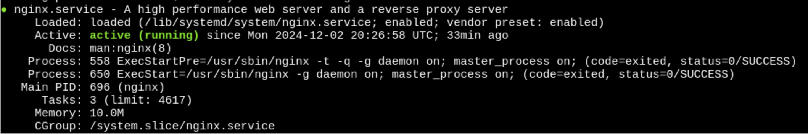
</p>
<p align="center" style="font-weight: bold;">
Figure-3: la sortie de la commande qui affiche l’état du serveur Nginx
</p>

Il est également possible de s'assurer que le serveur affiche correctement la page d’accueil en saisissant l’URL suivante dans la barre d’adresse du navigateur :

<p align="center">
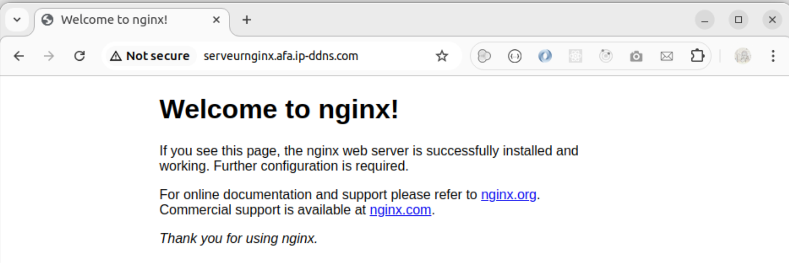
</p>
<p align="center" style="font-weight: bold;">
Figure 4: affichage de la page d’acceuil du serveur Nginx
</p>

_Remarque_ :

Vérifier que l'UFW (Uncomplicated Firewall) est désactivé. 
UFW un outil de configuration pare-feu conçu pour la gestion des règles de filtrage de paquet sur les distributions Debian et Ubuntu.

Voici quelques  commandes UFW:

```
# Check status
sudo ufw status
```
Pour activer et désactiver UFW :
```
# Enable/Disable
sudo ufw enable
sudo ufw disable
```


Nous créons un fichier **_/etc/nginx/conf.d/wordpress.conf_** tout en le configurant 
```
server {                                                             
    listen 80;
    root /var/www/html/wordpress;
    index  index.php index.html index.htm;
    server_name <YOUR_DNS>;
    client_max_body_size 500M;
    location / {
        try_files $uri $uri/ /index.php?$args;
    }
    location = /favicon.ico {
        log_not_found off;
        access_log off;
    }
    location ~* \.(js|css|png|jpg|jpeg|gif|ico)$ {
        expires max;
        log_not_found off;
    }
    location = /robots.txt {
        allow all;
        log_not_found off;
        access_log off;
    }
    location ~ \.php$ {
         include snippets/fastcgi-php.conf;
         fastcgi_pass unix:/var/run/php/php7.4-fpm.sock;
         fastcgi_param SCRIPT_FILENAME $document_root$fastcgi_script_name;
         include fastcgi_params;
    }
}
```

#### Automatiser l'installation de Nginx
L'installation de Nginx peut être effectuée en exécutant le script "install_nginx.sh". 

Il est impératif de fournir le paramètre <URL> obtenu lors de la création du nom de domaine sur la plateforme CloudDNS. 

3. ### Installation de la base de données MariaDB
Pour installer la base de données MariaDB, nous exécutons la commande suivante :

```
sudo apt-get install mariadb-server mariadb-client
```

Cette commande permet d’installer le serveur MariaDB ainsi que l’outil en ligne de commande nécessaire pour se connecter à la base de données et interagir avec elle.

Pour vérifier que le service MariaDB est opérationnel, nous exécutons la commande suivante :

```
sudo systemctl status mariadb
```

Voici le résultat de cette commande :
<p align="center">
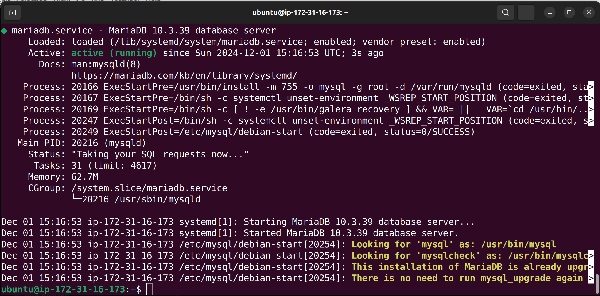
</p>
<p align="center" style="font-weight: bold;">
Figure 5: la sortie de la commande qui affiche l’état du service MariaDB
</p>

Il est possible de sécuriser l’installation de la base de données soit de manière interactive, en exécutant le script de sécurisation, soit en exécutant manuellement des instructions SQL pour chaque étape, comme illustré dans le script Bash ci-joint.

Si l'on choisit d’exécuter le script de sécurisation, nous exécutons la commande : 

```
sudo mysql_secure_installation
```

Dans ce cas, l’utilisateur est invité à définir un mot de passe pour l’utilisateur root, à conserver ou supprimer les utilisateurs anonymes, à désactiver ou non l’accès root à distance, ainsi qu’à supprimer la base de données de test.

Pour se connecter à la base de données, nous exécutons la commande : 
```
sudo mariadb -u root -p
```
<p align="center">
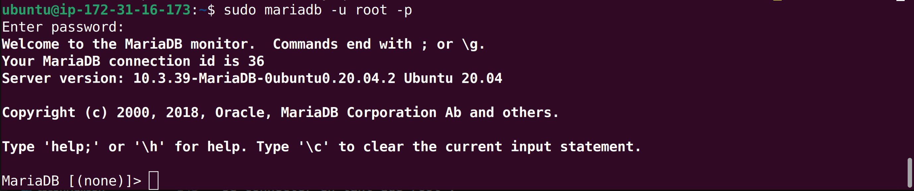
</p>
<p align="center" style="font-weight: bold;">
Figure 6: la sortie qui montre la connection à la BD mariadb
</p>


Nous créons la base de données nommée **_afadb_**, ainsi que d'un utilisateur **_afauser_** avec un mot de passe **_afapwd_**, selon les étapes suivantes :

```
create database afabd;
create user ‘afauser’@’localhost’ IDENTIFIED BY 'afapwd’; 
```

Ensuite, nous accordons tous les privilèges, à l’exception de la suppression :

```
grant SELECT, INSERT, UPDATE, CREATE, INDEX, ALTER, CREATE on afadb.* to 'afauser'@'localhost';
```

Une fois la configuration de la base de données terminée, il convient d’exécuter la commande **_exit_** afin de se déconnecter et de revenir à l’invite utilisateur.

#### Automatiser l'installation de la BD MariaDB :
L'installation de la base de données MariaDB peut être effectuée en exécutant le script "install_mariadb.sh".

Le script de sécurisation n'a pas été exécuté en mode interactif comme indiqué ci-dessus; nous l'avons automatisé en implémentant chaque phase afin qu'elle s'exécute en mode silencieux.

4. ### Installation de PHP

Pour installer PHP, nous exécutons la commande suivante :

```
sudo apt install php php-fpm php-curl php-mysql php-gd php-mbstring php-xml php-imagick php-zip php-xmlrpc -y
```
Tester la version installer de PHO avec la commande 

```
php -v
```

<p align="center">
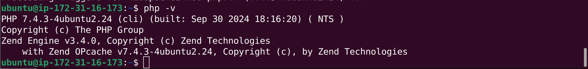
</p>
<p align="center" style="font-weight: bold;">
Figure 7: afficher la version de PHP installée
</p>

Nous devons modifier le fichier de configuration **_/etc/php/7.4/fpm/php.ini_** en modifiant les lignes suivantes :

```
cgi.fix_pathinfo=0
upload_max_filesize=128M
post_max_size=128M
memory_limit=512M
max_execution_time=120
```

#### Automatiser l'installation de PHP :
L'installation PHP peut être effectuée en exécutant le script "install_php.sh".

Il est nécessaire de spécifier comme paramètre la version de PHP à installer en fonction de la distribution Ubuntu utilisée.

5. ### Installation de WordPress

Executer les commandes suivantes :

```
cd /var/www/html
```
Télécharger l'application avec la commande :

```
sudo wget https://wordpress.org/latest.tar.gz
```

Décompresser le fichier téléchargé : 

```
sudo tar -zxvf latest.tar.gz
```
Changer le nom du fichier de configuration :

```
sudo mv /var/www/html/wordpress/wp-config-sample.php /var/www/html/wordpress/wp-config.php
```
Modifier les paramètres de la BD en éditant le fichier suivant avec les droits sudo :
```
sudo vim /var/www/html/wordpress/wp-config.php
```

```
define( 'DB_NAME', 'afadb' );
define( 'DB_USER', 'afauser' );
define( 'DB_PASSWORD', 'afapwd' );
define( 'DB_HOST', 'localhost' );
```

#### Automatiser l'installation de WordPress :
L'installation WordPress peut être effectuée en exécutant le script "install_wordpress.sh".

6. ### Lancement de la pile LEMP
Pour finaliser l’installation de WordPress, nous saisissons l’URL suivante dans la barre d’adresse du navigateur : **_serveurnginx.afa.ip-ddns.com/_** 


<p align="center">
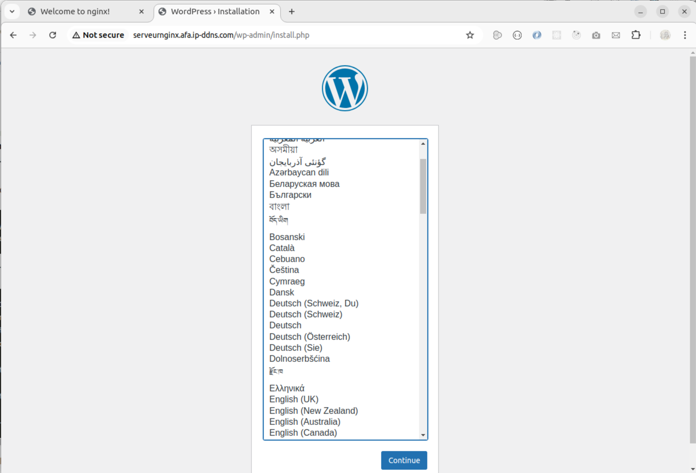
</p>
<p align="center" font-weight="bold">
 Figure 8: La première page de configuration de WordPress
</p>


<p align="center">
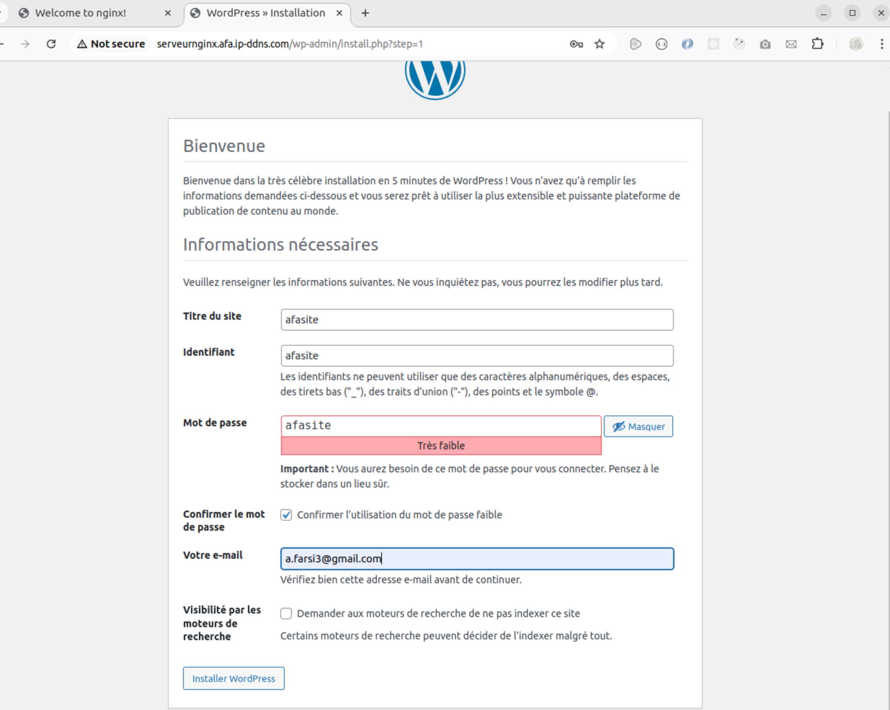
</p>
<p align="center" style="font-weight: bold;">
Figure 9: Page à remplir pour finit la configuration
</p>


<p align="center">
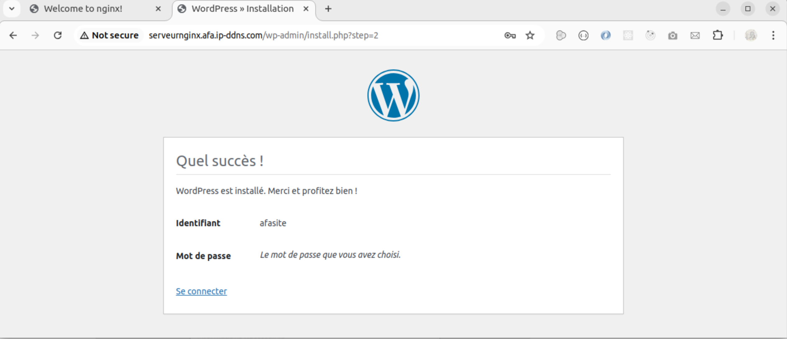
</p>
<p align="center" style="font-weight: bold;">
Figure 10: Page de la fin de configuration
</p>

Pour accéder au tableau de bord, il suffit de saisir directement l’URL suivante **_serveurnginx.afa.ip-ddns.com/wp-admin** : 

<p align="center">
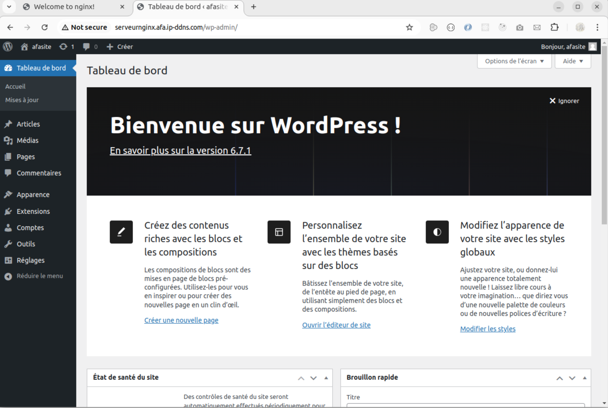
</p>
<p align="center" style="font-weight: bold;">
Figure 11: Widgets par défaut du tableau de borad
</p>

7. ### Sécurisation du site
Afin de garantir la sécurité des échanges sur notre site WordPress et de protéger les données de nos utilisateurs, nous avons opté pour la solution **Let's Encrypt**. 
Ce service gratuit et automatisé permet de mettre en place facilement un certificat SSL, indispensable pour activer le protocole HTTPS. 
Grâce à Let's Encrypt, les données transitant entre notre serveur et les navigateurs des internautes sont chiffrées, renforçant ainsi la confidentialité et l'intégrité des informations.

Afin d’activer le protocole HTTPS sur notre site, il est nécessaire d’installer sur notre système le client  **_Certbot_** proposé par **_Let's Encrypt_** comme suit:

```
sudo apt-get install python3-certbot-nginx -y
```
En suite, pour obtenir et installer automatiquement le certificat SSL, nous éxecutons la commande : 
```
sudo certbot --nginx -d serveurnginx.afa.ip-ddns.com
```
Si vous produisez un nombre excessif de certificats SSL via Let's Encrypt au cours d'une même journée, un message d'erreur vous informera que vous avez excédé le quota autorisé. Ce message spécifiera également la date à partir de laquelle il vous sera possible de soumettre une nouvelle demande. Cette restriction a été instaurée afin d'assurer une répartition équitable des ressources entre les utilisateurs et de prévenir tout usage abusif. La figure 12 montre le message affiché dans ce cas là.

<p align="center">
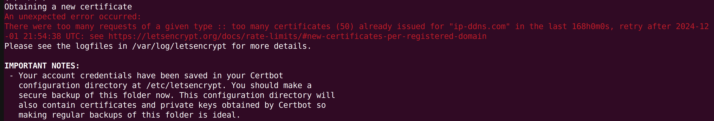
</p>
<p align="center" style="font-weight: bold;">
Figure 12: Message de dépassement du nombre de certificats généré par jour
</p>

Pour juste simuler la connexion sicurisée,  en testant la configuration sans réellement obtenir un nouveau certificat. Cette alternative est utile pour vérifier si la configuration est correcte avant de générer un certificat définitif.
```
sudo certbot --nginx –test-cert -d serveurnginx.afa.ip-ddns.com
```


Voici l’interaction générée par cette commande, qui nous invite à fournir une adresse électronique et à accepter les conditions d’utilisation :

<p align="center">
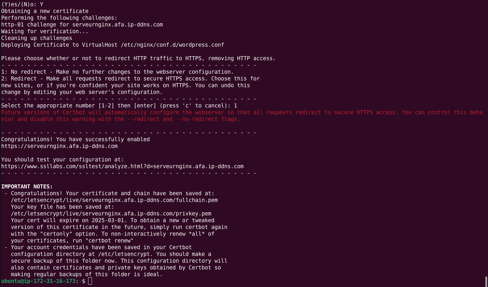
</p>
<p align="center" style="font-weight: bold;">
Figure 13: Dmande de saisir l'adresse mail et accepter les conditions d'utilisation
</p>

Finalement, cette configuration nous permet d’établir une connexion HTTPS sécurisée à notre site.

<p align="center">
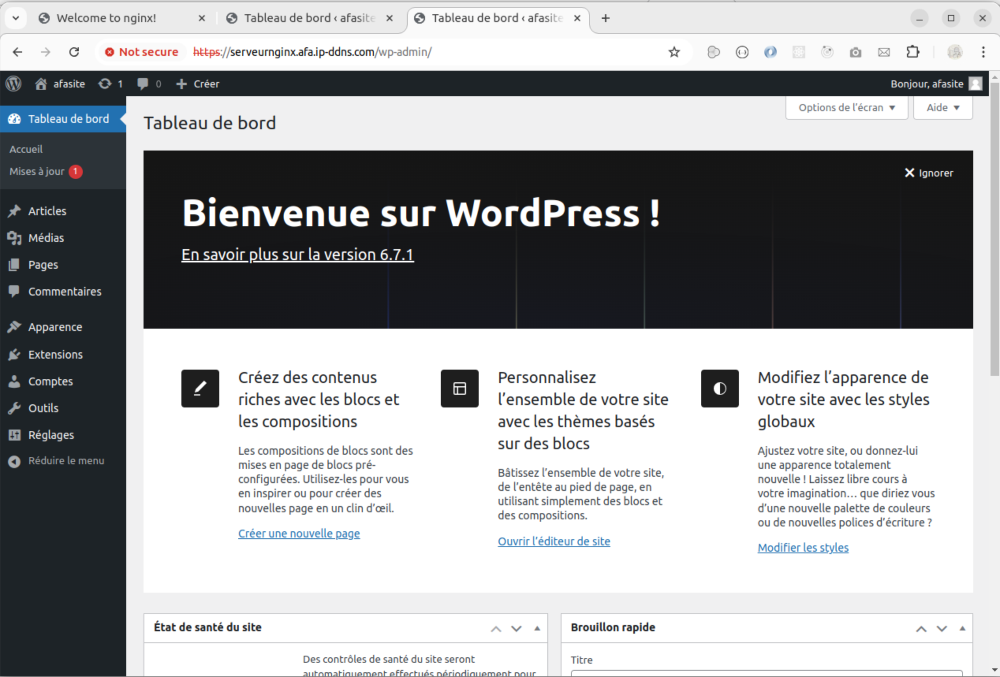
</p>
<p align="center" style="font-weight: bold;">
Figure 14: Connexion au site avec le protocole https
</p>

8. ### Sauvegarde de la base de données, du site, des fichiers logs et de configurations

Pour sauvegarder la base de données nous exécution la commande suivante:
```
mysqldump -u afauser -pafapwd afadb > ./mariadb_backup.sql
```

Pour effectuer une sauvegarde complète du site :
```
tar -czvf ./magento_files_backup.tar.gz /var/www/html/wordpress
```

Voici une capture d’écran illustrant le contenu du répertoire contenant les fichiers relatifs au certificat SSL généré par Let’s Encrypt, obtenus après une simple simulation :

<p align="center">
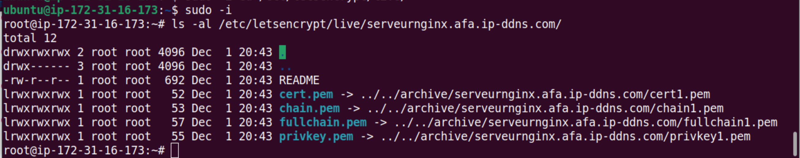
</p>
<p align="center" style="font-weight: bold;">
Figure 15: Contenu du répértoire etc/letsencrypt/serveugnginx.afa.ip-ddns.com
</p>

Nous avons dû attendre la date limite pour relancer la commande de génération du certificat. Voici la capture d’écran correspondante :

<p align="center">
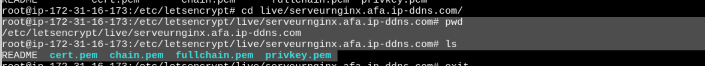
</p>
<p align="center" style="font-weight: bold;">
Figure 15: Contenu du répértoire etc/letsencrypt/serveugnginx.afa.ip-ddns.com
</p>

9. ### Points clés pour gérer efficacement un site WordPress

Dans un environnement de production nous devons prendre en considération les points suivants:

1. #### Choix de la machine virtuelle:
Sélectionnez une machine virtuelle disposant d’une capacité RAM suffisante pour supporter les charges de travail prévues. Si vous choisissez d’héberger votre base de données sur votre instance, utilisez un outil dédié comme WP-Optimize, spécifiquement conçu pour WordPress. Cet outil permet de réaliser des tâches de maintenance sur la base de données, telles que la suppression des données inutiles, l’optimisation des tables, etc...
Si vous préférez utiliser un service de base de données managé AWS, il est recommandé de mettre en place un système de mise en cache, comme Amazon ElastiCache pour Amazon RDS, ou Amazon DynamoDB Accelerator (DAX) dans le cas d’une base de données NoSQL.

2. #### Gestion des certificats SSL
Dans notre cas, nous avons utilisé _Let's Encrypt_ pour générer et gérer les certificats SSL. Si vous souhaitez une analyse détaillée de la configuration _SSL/TLS_ de votre site, il est possible d’utiliser un outil on-premises tel que _SSL Labs_.

Si vous optez pour une solution managée sur le cloud AWS, vous pouvez utiliser le service AWS Key Management Service (KMS) pour gérer vos clés et certificats en toute sécurité.

3. #### Configuration du reverse-proxy et sécurité
Configurez correctement votre reverse-proxy afin de gérer efficacement plusieurs sites en simultané. 

Assurez-vous que chaque site dispose d’un certificat SSL valide et de permissions adaptées. Redirigez toutes les requêtes HTTP vers HTTPS afin de renforcer la sécurité des communications.

4. #### Optimisation des performances
Intégrez un CDN (Content Delivery Network) tel qu’Amazon CloudFront pour réduire le temps de chargement grâce à la distribution des contenus depuis des serveurs géographiquement proches des utilisateurs.

Compressez les images sans perte de qualité à l’aide d’outils comme _Smush_ ou _Imagify_.

Minifiez les fichiers CSS et JavaScript pour améliorer le temps de rendu des pages.
Surveillez les performances globales de votre site avec des outils d’analyse tels que Google PageSpeed Insights ou GTmetrix, afin d’identifier et de corriger les éventuelles faiblesses.

5. #### Sauvegarde des données
Planifiez des sauvegardes automatiques régulières pour votre site et votre base de données à l’aide de solutions adaptées. Par exemple :

UpdraftPlus pour des sauvegardes on-premises.

AWS Backup pour les environnements cloud.

Stockez ces sauvegardes sur des services externes comme AWS S3, qui offre un stockage durable, scalable et sécurisé.

6. #### Mises à jour et gestion des configurations
Maintenez à jour WordPress, ses thèmes et plugins pour bénéficier des correctifs de sécurité et des nouvelles fonctionnalités. Dans un environnement cloud AWS, des outils comme _AWS Systems Manager_ peuvent être utilisés pour automatiser et simplifier la gestion des mises à jour et des configurations.

